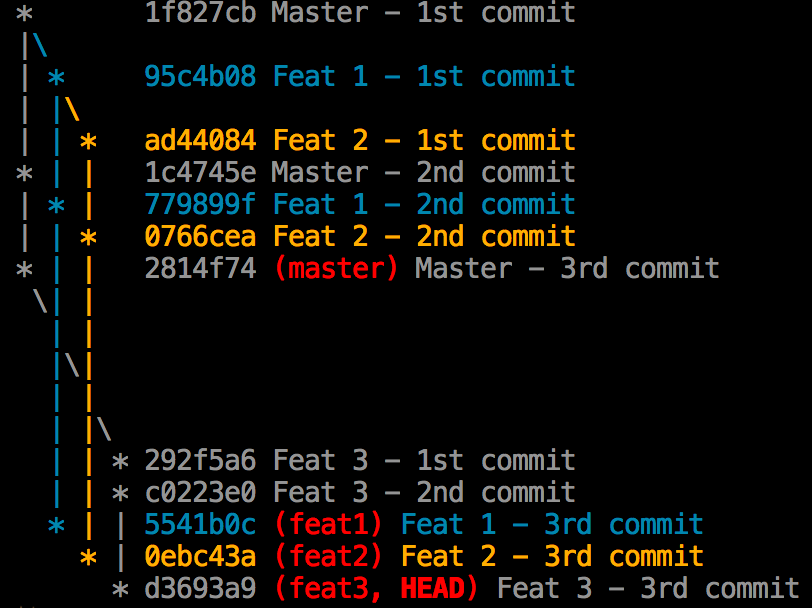
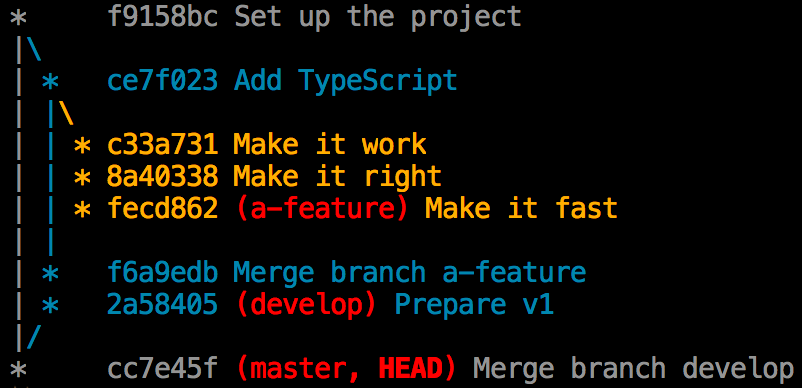

# Gitgraph node

Draw pretty git graphs in your terminal.



## Get started

> You need to have [npm][get-npm] installed.

Install the package with npm: `npm i --save gitgraph-node`

Then, use it in your node.js scripts.

[get-npm]: https://www.npmjs.com/get-npm

## Example of usage

Let's pretend this is your `index.js`:

```js
const { gitgraph, render } = require("gitgraph-node");

// Simulate git commands with Gitgraph API.
const master = gitgraph.branch("master");
master.commit("Set up the project");

const develop = gitgraph.branch("develop");
develop.commit("Add TypeScript");

const aFeature = gitgraph.branch("a-feature");
aFeature
  .commit("Make it work")
  .commit("Make it right")
  .commit("Make it fast");

develop.merge(aFeature);
develop.commit("Prepare v1");

master.merge(develop).tag("v1.0.0");

// Call `render` to log the graph in terminal.
render();
```

Running `node index.js` will produce following output:



## Meta

Authors:

- **Nicolas Carlo** - [@nicoespeon](https://twitter.com/nicoespeon) - <http://nicoespeon.com>
- **Fabien Bernard** - [@fabien0102](https://twitter.com/fabien0102)

Distributed under the [MIT license][mit-license].

[💁 What does "MIT license" means?](license-explained)

[mit-license]: https://github.com/nicoespeon/gitgraph.js/blob/master/LICENSE.md
[license-explained]: http://choosealicense.com/licenses/mit/
